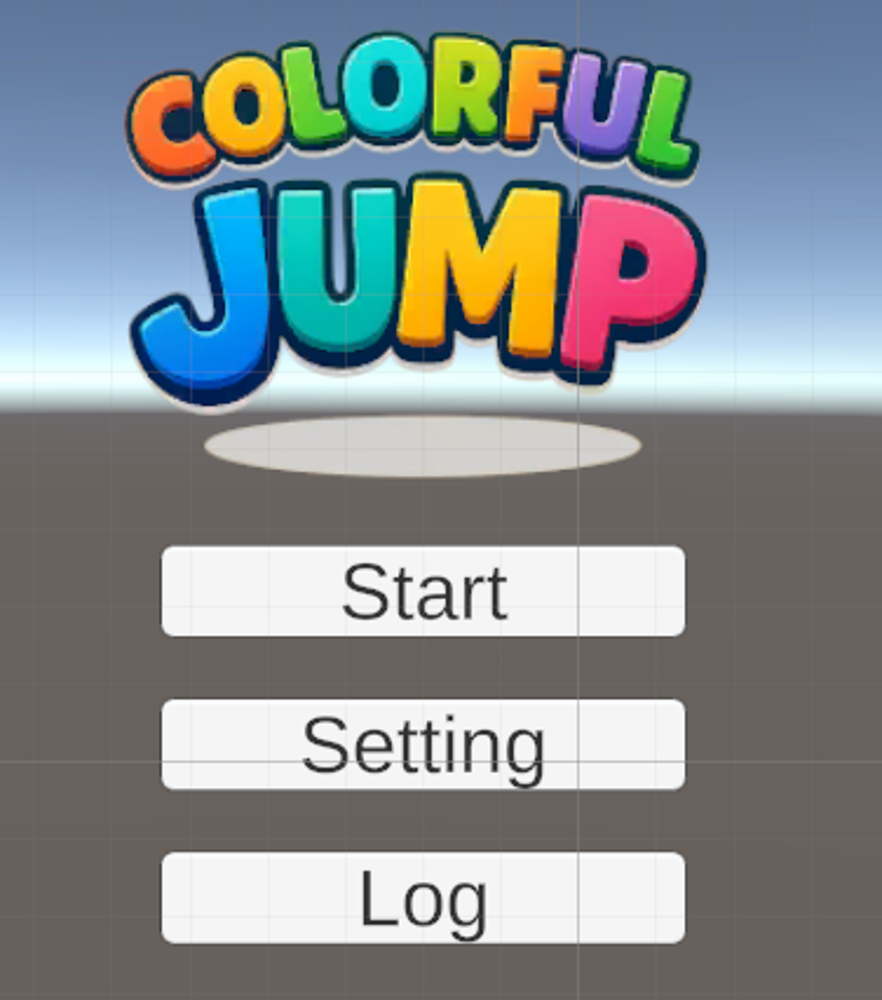
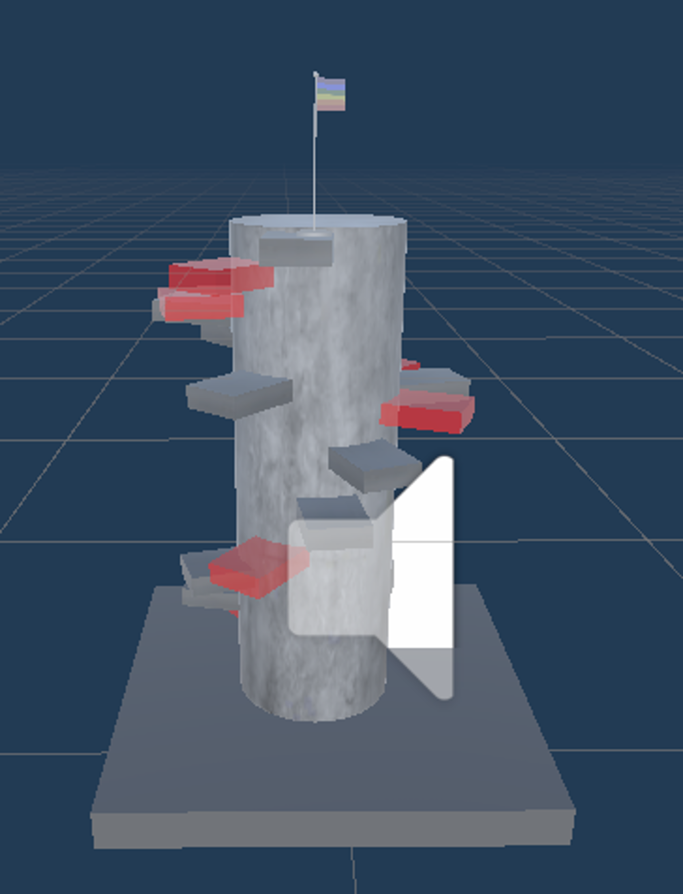
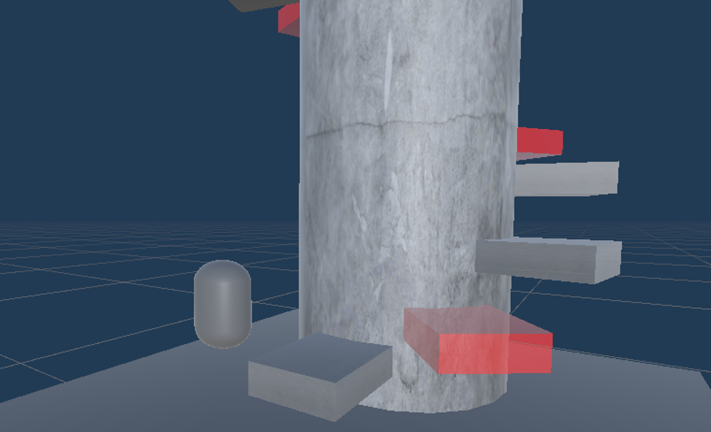
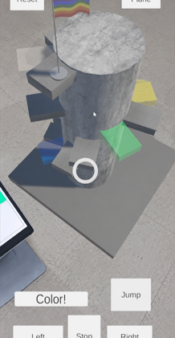

# Unity AR Color Platformer

This repository contains the AR detecting and color-based platform activation logic that I implemented and reorganized from a team project in the **Immersive Media Programming** course.

The original project was a Unity-based mobile AR 3D platformer.  
The game places a 3D platform map on a detected real-world plane, and the player activates platforms by detecting the correct color through the mobile camera.

> Note: This repository is organized for portfolio review and contains selected scripts and screenshots related to my contribution, not the full Unity project.

---

## Project Overview

**Project Name:** Colorful Jump - AR 3D Platformer  
**Type:** Team Project, 4 members  
**Course:** Immersive Media Programming  
**Period:** 2025.03 ~ 2025.05  
**Tech Stack:** Unity, C#, AR Foundation, ARCameraManager, Mobile AR Interaction

The main concept of the project was to create an AR-based 3D platformer where the player interacts with both the virtual map and the real-world environment.

Core gameplay flow:

1. Detect a real-world plane.
2. Spawn a 3D platform map on the detected plane.
3. Use the mobile camera to find and detect a target color.
4. Activate the platform that matches the detected color.
5. Move the player character through the activated platforms.

---

## My Contribution

My main contribution focused on:

- AR camera-based color detection
- Color matching logic
- UI feedback for detected colors
- Platform activation logic
- Linking color detection results with gameplay state

In this project, I implemented the logic that obtains camera image data through `ARCameraManager`, samples the center area of the screen, compares the detected RGB values with the target platform color, and activates the corresponding platform when the color matches.

---

## Repository Structure

```text
unity_ar_color_platformer/
├── Scripts/
│   ├── ColorDetect.cs
│   ├── button1.cs
│   ├── block1.cs
│   └── ChangePanelColor.cs
│
├── Screenshots/
│   ├── main_title.png
│   ├── map1.png
│   ├── map2.png
│   └── color_detection.png
│
└── README.md
```

---

## Main Scripts

### `ColorDetect.cs`

A prototype script for detecting a target color from the AR camera image.

Main features:

- Uses `ARCameraManager` to acquire the latest CPU camera image.
- Converts the camera image into RGBA format.
- Samples the center region of the screen.
- Compares the sampled color with the target color using RGB distance.

---

### `button1.cs`

The main gameplay logic for color detection and platform activation.

Main features:

- Handles the behavior of the color detection button.
- Finds the next platform object tagged as `Block`.
- Reads the target platform color.
- Detects whether the user is pointing the camera at the matching real-world color.
- Updates the UI panel when the target color is detected.
- Activates the matching platform after successful detection.

---

### `block1.cs`

Controls each platform block's visual state and collider state.

Main features:

- Initializes blocks as semi-transparent and non-collidable.
- Stores the target color of each platform.
- Activates the block by changing its material color and enabling its collider.

---

### `ChangePanelColor.cs`

Handles UI feedback for detected colors.

Main features:

- Stores the detected color.
- Updates the UI panel color when the player presses the color button.
- Maintains whether a valid color has been detected.

---

## Implementation Details

### AR Camera Color Detection

The color detection logic uses `ARCameraManager.TryAcquireLatestCpuImage()` to access the mobile camera frame.  
The acquired image is converted to `TextureFormat.RGBA32`, and a small region around the center of the screen is sampled.

The sampled RGB value is compared with the current target platform color.

```csharp
bool IsColorMatch(Color c1, Color c2)
{
    return Vector3.Distance(
        new Vector3(c1.r, c1.g, c1.b),
        new Vector3(c2.r, c2.g, c2.b)
    ) <= colorThreshold;
}
```

This allowed the game to determine whether the player was pointing the mobile camera at the correct real-world color.

---

### Platform Activation Logic

Each platform starts in a semi-transparent state with its collider disabled.  
When the correct color is detected, the platform becomes fully visible and its collider is enabled, allowing the player to step on it.

```csharp
public void SetBlock(Color newColor)
{
    mat.SetColor("_BaseColor", newColor);
    collider.enabled = true;
    isColor = true;
}
```

This connects AR camera input with actual gameplay progression.

---

## Screenshots

### Main Title




### AR Platform Map

<p align="left">
  
  
</p>

### Color Detection




---

## What I Learned

Through this project, I gained hands-on experience with mobile AR interaction using Unity and AR Foundation.

In particular, I learned how to:

- Access AR camera image data in Unity.
- Process camera frame data for interaction logic.
- Connect real-world visual input with virtual game objects.
- Manage object visibility and collider states based on AR interaction results.
- Design gameplay logic that combines physical space and digital content.

This project helped me understand AR not only as a rendering feature, but also as an interaction system that connects camera input, real-world context, and virtual content.
